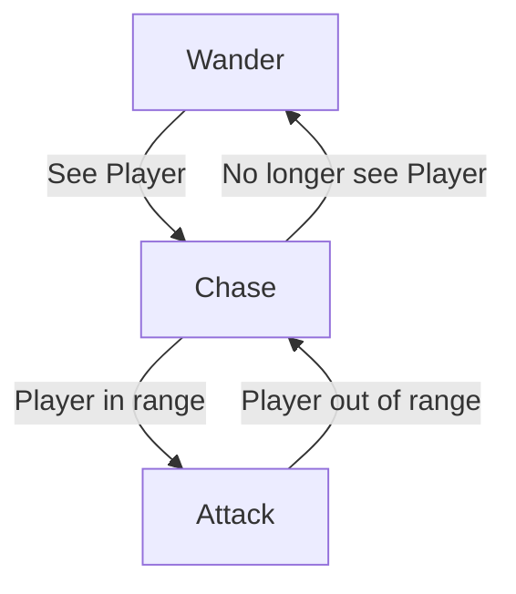

# CS5410 - Class 6 - 2-11-26 Notes

## Annoucements

- Assignment due tonight

- In Assignment 2.2 implement a weighted random. see [2-4-26](2-4-26.md) notes for details

- For extra credit use a tile map layer

- You do need to use the bitmask

---

## Binary Space Partitioning (BSP)

1. Start with one big square
2. Split it into two rectangles (horizontally or vertically)
3. Split each rectangle into two rectangles (horizontally or vertically)
4. Continue until you have the desired number of rectangles
5. Once you got all the spaces, you generate a room in each rectangle
6. After the rooms are generated you draw a line between the centers of the rooms to create a hallway

    - This algorithm uses a binary tree with nodes to keep track of the rectangles.

    - Essentially you are starting with one node, and then creating 2 child nodes, and then creating 2 child nodes for each of those, and so on until you have the desired number of rectangles.

    - The hallways are drawn from the center of the partition area, not the center of the room.

### Restraints

- Always split the rectangle on the longest axis. This way we don't get skinny rectangles.

- Another restraint is position. You want to make sure both rectangles meet a minimum size requirement. If the rectangle is too small, you don't split it.

- Maximum depth of the tree, so you don't end up with too many or too small rectangles. 6 is a good number for this.

- Split probability, so you don't end up with too many rectangles. This could be an option the user can set. If you have it at 50% you'll have bigger rooms and smaller rooms, but if you have it at 90% you'll have more smaller rooms and fewer bigger rooms.

### BSP Tree Management

- You need to keep track of each rectangle's position and size. Use the top left corner as the position and the width and height as the size. You also need to keep track of the direction of the split (horizontal or vertical) and maybe the depth of the node in the tree.

  - Use this to decide where to draw the lines for the hallways.

- The room needs to cover the middle of the partition area.

- You can store the room size in the nodes too, those can just be stored on the leaf nodes.

- Draw the hallways between all sibling pairs in the BSP tree.

### Game Design

- Encourage exploration by placing boss key on opposite end of the tree as the boss. This way the player has to explore the entire map to find the boss key.

- Lots of variation on this algorithm. You can add more rooms in each rectangle, you can add secret rooms, you can add more hallways, etc.

- You don't have to traverse the tree with recursion, you can use a queue or a stack and a for loop to manage the tree. This way you can do a breadth first or depth first traversal.

### Variation of BSP (non tree)

- If we want more flexibility in placing our rooms and always we can use another strategy.

- Hes not gonna make us use this algorithm, but it's good to know about it.

- **Strategy:**
  - Take my rooms, take a circle, and I say inside the area of the circle im gonna randomly place my rooms
  - Then we apply a seperation steering behavior to the rooms to push them away from each other. Find any neighbors that are close to it and apply a force to push them away.
  - Eventually we end up with all the rooms are no longer overlapping in any way
  - Then we do an algorithm called daelaunay triangulation to connect all the rooms together. This creates a graph of the rooms and the connections between them.
  - This draws edges to the rooms in a way such that we never end up overlapping edges in physical space.
  - This tells us which rooms are gonna have hallways between them. We can then use a minimum spanning tree algorithm to find the minimum number of hallways we need to connect all the rooms together. This way we don't end up with too many hallways.
  - get rid of all the edges in the minimum spanning tree to create something kinda like BSP, but backwards...

---

## Random Walk

- True graph you must manage
- Conceptually the simplest, but tricky to implement

    1. I place a room
    2. Pick a random direction (north, south, east, west)
    3. Move that direction place a room
    4. Pick another direction and repeat until you have the desired number of rooms

- You randomly walk in a direction
- To implement that is just a basic graph where each room is a node and the hallways between them is the edge.
- You could use an adjacency list to keep track of the graph.
- In godot use a Vector2 to represent the position of the room. so each node will have:
  - Location
  - left edge
  - right edge
  - top edge
  - bottom edge

- Edge class will have:
  - Room 1
  - Room 2
  - Direction (0,1)

- Adjacency list esque implementation

- There should only be one edge between any two rooms.

### Wrinkle

- New Constraints:
  - NO LOOPS. You can't walk back to a room you've already been in. This way you don't end up with loops in your graph.
  - Minimum walk distance. You have to walk a certain number of steps before you can place a room. This way you don't end up with rooms that are too close together.
  - If you create a room where you can't satisfying the minimum walk distance, you have to backtrack and try a different direction. This way you don't end up with rooms that are too close together.
  - Can you backtrack without deleting the rooms you already placed?
    - Yes, you CAN move into a room that your backtracking from, but you can't place a room there. This way you don't end up with loops in your graph. this way the room becomes a dead end, but you can still walk through it to get to other rooms.

- You could have a parameter called like step chance after you reach your minimum walk distance.

- your rooms should be multiples of the room size, so you can easily check if a room is already there by checking if the position is a multiple of the room size.

- Easy math broham and yeah

- Of all the algorithms minus wave function collapse, this is the algorithm you will spend the most time debugging!

- Binding of isaac uses this algorithm

### Game Design For Random Walk

- Common strategy is to generate a "critical path" that might not have any loops in it.
  - This could be a path that leads to the boss room so you have some control over the pacing of the game.
  - Then you can branch off of that critical path. 
  - Pick any arbitrary room on the critical path and generate a branch, and place the key in one of the leave nodes.
- Graph replacement
  - You have a rule that you wanna apply to your graph, each one of the rooms has a type. 
  - 4 different room types
    - S - start
    - I - item
    - E - enemy
    - P - puzzle
    - B - boss
  - you manually set the start and the boss room, and then all the rest of the rooms are empty. and then we have a rule that says, we cannot have more than 2 empty rooms next to each other. then you scan the graph in 2 room pairs. if you have 2 empty rooms, randomly pick one of our room types and replace one of the empty rooms with that room. then you keep going until you have no more empty rooms next to each other.
  - After you've gone through with that rule, you can traverse the graph with another rule, such as no enemy rooms next to each other, and then you can replace one of the enemy rooms with an item room, and then you keep going until you have no more enemy rooms next to each other. This way you can add some variety to your graph without having to manually place every single room.
  - Often times you are modifying the structure of the graph with graph replacement, but with random walk we won't, just the meta data about the room.

## State Pattern

- In game I have an enemy that hunts me down, but if im far enough away I want it to stop, if its close i want it to attack. This enemy has several states:
  - Wander
  - Follow
  - Attack
- These states also have transitions between them.
  - If the player is within a certain distance, transition from wander to follow.
  - If the player is within a certain distance, transition from follow to attack.
  - If the player is outside of a certain distance, transition from attack to follow.
  - If the player is outside of a certain distance, transition from follow to wander.

- A lot of objects will have many much more states than this.

- How do you check these states? With a giant block of if else statements? Nah that shit sucks, theres a better way called state pattern

- First, create a character and add a script to it. 

```cs

using Godot;
using System;

public partial class Character : CharacterBody2D
{
    public float Speed = 200f;
    public override void _Process(double delta){
        // 1. Set up character movement
        float moveX = Input.GetAxis("ui_left", "ui_right");
        float moveY = Input.GetAxis("ui_up", "ui_down");
        Velocity = new Vector2(moveX, moveY).Normalized() * Speed;
        // 2. Flip sprite based on movement direction
        if (moveX != 0){
            _sprite.FlipH = moveX < 0;
        }
        moveAndSlide();
    }

}
```

- Now, create a new scene called enemy.tscn and add a new script called enemy.cs to it.

```cs
using Godot;
using System;

public partial class Enemy : CharacterBody2D
{
    // States:
    // Wander
    // Chase
    // Attack
    private IEnemyState _currentState;

    public ovverride void _Ready()
    {
        // Set initial state to wander
        _currentState = new WanderState();
        _currentState.Init(this);
        _currentState.Enter();
    }

    public override void _Process(double delta)
    {
        // Execute whatever the current state is
        _currentState.Process(delta);
    }

    public void ChangeState(IEnemyState state)
    {
        _currentState.Exit();
        _currentState = state;
        _currentState.Init(this);
        _currentState.Enter();
    }


}
```

- State Pattern is a finite automata. Each node we'll call a state. We have 3 states, and 3 nodes. And the edges between the states are the transitions and also define the conditions on which we transition.

<center>



</center>

- New script for states, this will be like our worldmanager, but for the enemy states. its like our enemy manager. This is where we will define our states and transitions.

```cs
public interface IEnemyState
{
    void Enter();
    void Exit();
    void Process(float delta);

    void Init(Enemy enemy); // Takes the enemy that this state is attached to (we can reuse this shit for all the enemies)

}
```

- We need a seperate script for each state for wander state:

```cs
//WANDER STATE
public partial class WanderState : IEnemyState
{
    private Enemy _enemy;

    public void Enter()
    {
        // On a timer, transition to the chase state
        // In real life we would say some shit like if position is within range of character then transition to chase state
        GD.Print("Entering Wander State");
        Timer timer = new Timer();
        timer.Timeout += () => {
        _enemy.ChangeState(new ChaseState());
        timer.QueueFree();
    };
    timer.Start(3);
    _enemy.AddChild(timer);
    }

    public void Exit()
    {
        GD.Print("Exiting Wander State");
    }

    public void Process(double delta)
    {
        // Implement wander behavior
    }

    public void Init(Enemy enemy)
    {
        _enemy = enemy;
    }
}
```


### Recap

- We created an enemy character with different states: Wander, Chase, and Attack.
- We created a state transition system using the State Pattern.
- We implemented each state as a separate class, allowing for cleaner code and easier maintenance.
- We made enemy state an interface